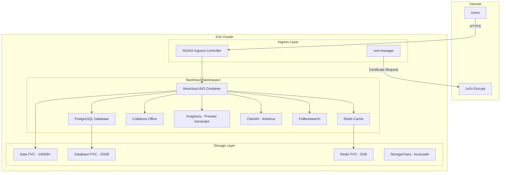

# Nextcloud All-in-One (AIO) Deployment Plan for K3s on ThreeFold Grid

## Executive Summary
This document outlines the comprehensive plan for deploying Nextcloud All-in-One (AIO) on the existing K3s cluster infrastructure running on ThreeFold Grid. The deployment will be fully automated, accessible from the public internet with proper SSL/TLS encryption, and integrated with the existing make-based deployment system.

## Architecture Overview

### Current Infrastructure
- **Platform**: K3s on ThreeFold Grid with public IPv4 addresses
- **Nodes**: Configurable control plane (4-8 vCPU, 8-16GB RAM) and worker nodes (8-16 vCPU, 16-128GB RAM, 250-2000GB disk)
- **Management**: Dedicated management node with kubectl, helm, k9s, and ansible
- **Networking**: WireGuard for secure node communication, Mycelium IPv6 overlay

### Nextcloud AIO Architecture


## Implementation Components

### 1. Storage Configuration

#### StorageClass Definition
- Use K3s default `local-path` provisioner for persistent storage
- Configure retention policy for data protection
- Set up volume snapshots for backup capability

#### Persistent Volume Claims
- **Nextcloud Data**: 100-500GB (configurable based on deployment size)
- **PostgreSQL Database**: 20GB
- **Redis Cache**: 5GB
- **Backup Storage**: 50% of data volume size

### 2. Ingress and SSL/TLS Configuration

#### Components
- **NGINX Ingress Controller**: Already included in K3s
- **cert-manager**: For automatic SSL certificate management
- **Let's Encrypt**: Free SSL certificates with auto-renewal

#### Domain Configuration
- Support for custom domain (e.g., nextcloud.example.com)
- Automatic DNS validation or HTTP-01 challenge
- Wildcard certificate support for subdomains

### 3. Nextcloud AIO Components

#### Core Services
- **Nextcloud Server**: Main application with web interface
- **PostgreSQL 15**: Primary database
- **Redis 7**: Session and file locking cache
- **Apache**: Web server (included in AIO container)

#### Optional Services (Enabled by Default)
- **Collabora Online**: Office document editing
- **Imaginary**: High-performance image preview generation
- **ClamAV**: Antivirus scanning
- **Elasticsearch**: Full-text search capability
- **Talk**: Video conferencing with TURN server

### 4. Security Configuration

#### Network Security
- All traffic encrypted with TLS 1.3
- Strict Transport Security (HSTS) headers
- Content Security Policy (CSP) headers
- Rate limiting on ingress

#### Application Security
- Strong password policies enforced
- Two-factor authentication available
- Brute force protection
- File encryption at rest (optional)
- Regular security updates via AIO container

### 5. Backup and Disaster Recovery

#### Backup Strategy
- Daily automated backups of database
- Incremental file backups using restic
- Configuration backup to management node
- Off-cluster backup to ThreeFold Grid storage (optional)

#### Recovery Procedures
- Point-in-time recovery capability
- Automated restore scripts
- Documentation for manual recovery
- Regular restore testing procedures

## Implementation Files Structure

```
tfgrid-k3s/
├── nextcloud/
│   ├── namespace.yaml              # Nextcloud namespace definition
│   ├── storage/
│   │   ├── storageclass.yaml      # Storage class configuration
│   │   └── pvcs.yaml              # Persistent volume claims
│   ├── ingress/
│   │   ├── cert-manager.yaml      # cert-manager installation
│   │   ├── issuer.yaml            # Let's Encrypt issuer
│   │   └── ingress.yaml           # Ingress rules for Nextcloud
│   ├── values/
│   │   ├── nextcloud-aio.yaml    # Helm values for Nextcloud AIO
│   │   └── config.yaml            # Additional configuration
│   ├── backup/
│   │   ├── backup-cronjob.yaml   # Automated backup job
│   │   └── restore-job.yaml      # Restore job template
│   └── deploy.sh                  # Deployment script
├── scripts/
│   ├── nextcloud.sh               # Main Nextcloud deployment script
│   └── nextcloud-backup.sh        # Backup management script
└── platform/
    └── roles/
        └── nextcloud/              # Ansible role for Nextcloud
            ├── tasks/
            │   └── main.yml
            ├── templates/
            │   └── values.yaml.j2
            └── vars/
                └── main.yml

```

## Deployment Process

### Phase 1: Prerequisites
1. Verify K3s cluster is running and healthy
2. Ensure sufficient resources on worker nodes
3. Configure DNS records for domain
4. Set environment variables for configuration

### Phase 2: Infrastructure Setup
1. Create Nextcloud namespace
2. Deploy cert-manager for SSL management
3. Configure Let's Encrypt issuer
4. Create storage class and PVCs

### Phase 3: Nextcloud Deployment
1. Deploy Nextcloud AIO using Helm
2. Configure ingress with SSL
3. Initialize admin account
4. Configure external storage (optional)
5. Enable required apps and features

### Phase 4: Post-Deployment
1. Configure backup schedules
2. Set up monitoring and alerts
3. Document access credentials
4. Perform initial backup
5. Test restore procedure

## Configuration Variables

### Infrastructure Variables (credentials.auto.tfvars)
```hcl
# Nextcloud-specific configuration
nextcloud_domain = "nextcloud.example.com"
nextcloud_storage_size = 100  # GB
nextcloud_admin_email = "admin@example.com"
nextcloud_backup_retention = 7  # days
```

### Deployment Variables
```yaml
# nextcloud/values/config.yaml
nextcloud:
  domain: ${NEXTCLOUD_DOMAIN}
  adminEmail: ${NEXTCLOUD_ADMIN_EMAIL}
  storage:
    dataSize: ${NEXTCLOUD_STORAGE_SIZE}Gi
  features:
    collabora: true
    talk: true
    imaginary: true
    clamav: true
    fulltextsearch: false  # Resource intensive
  backup:
    enabled: true
    schedule: "0 2 * * *"  # Daily at 2 AM
    retention: ${NEXTCLOUD_BACKUP_RETENTION}
```

## Make Target Integration

### New Makefile Targets
```makefile
# Deploy Nextcloud AIO
nextcloud:
	cd scripts && bash nextcloud.sh

# Backup Nextcloud data
nextcloud-backup:
	cd scripts && bash nextcloud-backup.sh backup

# Restore Nextcloud from backup
nextcloud-restore:
	cd scripts && bash nextcloud-backup.sh restore

# Full deployment including Nextcloud
all-with-nextcloud: infrastructure platform nextcloud

# Clean Nextcloud deployment
clean-nextcloud:
	cd scripts && bash nextcloud.sh clean
```

## Resource Requirements

### Minimum Requirements (Small Deployment)
- **Worker Nodes**: At least 2 nodes with 8 vCPU, 16GB RAM, 250GB disk
- **Storage**: 100GB for Nextcloud data
- **Network**: Public IPv4 for ingress

### Recommended Requirements (Medium Deployment)
- **Worker Nodes**: 3+ nodes with 8 vCPU, 32GB RAM, 500GB disk
- **Storage**: 250GB for Nextcloud data
- **Network**: Public IPv4 with good bandwidth

### Large Deployment
- **Worker Nodes**: 5+ nodes with 16 vCPU, 64GB RAM, 1TB disk
- **Storage**: 500GB+ for Nextcloud data
- **Network**: Multiple public IPs for load balancing

## Monitoring and Maintenance

### Monitoring Components
- Prometheus metrics from Nextcloud
- Grafana dashboards for visualization
- Alert manager for critical issues
- Log aggregation with Loki

### Maintenance Tasks
- Weekly security updates check
- Monthly performance review
- Quarterly capacity planning
- Annual disaster recovery drill

## Security Considerations

### Network Security
- Firewall rules limiting access
- DDoS protection at ingress
- Geographic restrictions (optional)
- VPN-only access (optional)

### Data Security
- Encryption at rest
- Encryption in transit (TLS)
- Regular security audits
- Compliance with GDPR/HIPAA (configurable)

## Troubleshooting Guide

### Common Issues
1. **Certificate Issues**: Check cert-manager logs and DNS configuration
2. **Storage Issues**: Verify PVC binding and available disk space
3. **Performance Issues**: Check resource allocation and database tuning
4. **Access Issues**: Verify ingress configuration and firewall rules

### Debug Commands
```bash
# Check Nextcloud pods
kubectl get pods -n nextcloud

# View Nextcloud logs
kubectl logs -n nextcloud deployment/nextcloud-aio

# Check certificate status
kubectl get certificate -n nextcloud

# Verify ingress
kubectl get ingress -n nextcloud

# Check storage
kubectl get pvc -n nextcloud
```

## Testing Procedures

### Functional Testing
1. User registration and login
2. File upload/download
3. Sharing functionality
4. Collabora document editing
5. Video calls via Talk

### Performance Testing
1. Concurrent user load testing
2. Large file upload testing
3. Database query performance
4. Cache effectiveness

### Security Testing
1. SSL/TLS configuration scan
2. Vulnerability assessment
3. Penetration testing
4. Backup/restore verification

## Documentation Updates

### User Documentation
- Access URL and login procedures
- Feature overview and tutorials
- Backup and recovery procedures
- Troubleshooting guide

### Administrator Documentation
- Deployment procedures
- Configuration management
- Monitoring and alerting
- Scaling procedures

## Timeline and Milestones

### Week 1: Infrastructure Preparation
- Set up storage configuration
- Deploy cert-manager
- Configure DNS records

### Week 2: Nextcloud Deployment
- Deploy Nextcloud AIO
- Configure ingress and SSL
- Initial testing

### Week 3: Feature Configuration
- Enable additional apps
- Configure backup system
- Performance tuning

### Week 4: Production Readiness
- Security hardening
- Documentation completion
- User training
- Go-live

## Success Criteria

1. **Availability**: 99.9% uptime SLA
2. **Performance**: Page load < 2 seconds
3. **Security**: A+ SSL Labs rating
4. **Backup**: Daily backups with < 1 hour RPO
5. **Scalability**: Support for 100+ concurrent users

## Conclusion

This plan provides a comprehensive approach to deploying Nextcloud AIO on the K3s cluster running on ThreeFold Grid. The implementation focuses on automation, security, and scalability while maintaining ease of management through the existing make-based system.

The modular approach allows for customization based on specific requirements while maintaining a standard deployment pattern that can be easily replicated and maintained.